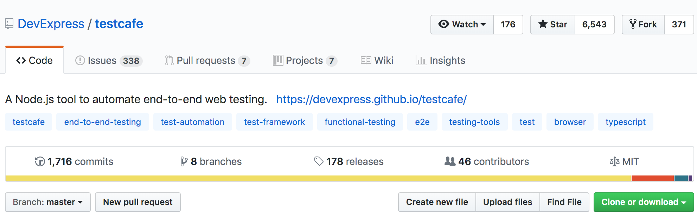
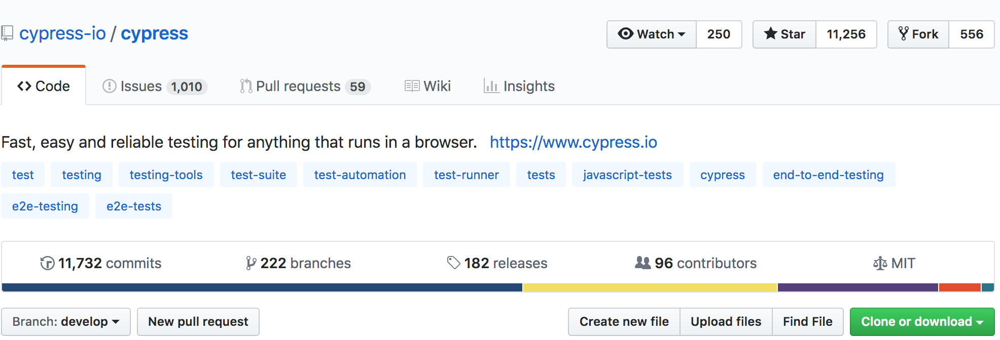

# TestCafe vs Cypress

> Open source e2e testing frameworks (non-webdriver 😍)

## Features
Overall they have pretty good feature parity (community plugins, screenshots, videos, debugging, api mocking, automatic waiting/retry, etc.) 

### TestCafe over Cypress 
1. TestCafe supports Chrome, IE, Firefox, Edge, Safari. Cypress only supports Chrome (but support for more is in development) 
2. Cypress can't run headless in watch mode, i.e. it has to start a real browser (slower for local dev)
3. TestCafe supports parallelization out the box. Cypress doesn't support parallelization locally, only on your CI server with a premium paid service (Cypress dashboard)

### Cypress over TestCafe
1. Cypress live mode offers a time travel UI for digging into the test steps and stores a snapshot of the component at that step (like Redux devtools)
2. Implicit waiting over explicit. You write Cypress tests synchronously. TestCafe you explicitly specify async/await.

## Community


Both have active communities.
- Cypress has more stars and contributors. Cypress charges for their dashboard services which enable parallelization.
- TestCafe (DevExpress) charge for TestCafe Studio which allows non developers to build tests by point and click.

## Future-proof
- Cypress has become a company itself with top tier VC funding, and the community is actively involved in it's dev.
- TestCafe is a product by DevExpress, a company that's sold dev products since 90s. It has active community contributors also.

## Syntax
Cypress simple:
```javascript
it('changes text when clicked', () => {
  cy.get('[data-testid=btn-id]').click()
  cy.get('[data-testid=btn-id]').should('contain', 'You clicked me')
})
```

TestCafe simple:
```javascript
test('changes text when clicked', async t => {
  await t
    .click(Selector('[data-testid=btn-id]'))
    .expect(Selector('[data-testid=btn-id]').textContent)
    .contains('You clicked me')
})
```

## Performance
> on my mac osx 10.13.2

Three runs of:

`time npm run cypress` vs `time npm run testcafe`

Total time:
- Cypress average: 35s (min: 35s, max: 35s)
- TestCafe average: 20s (min: 19s, max: 21s)

Actual test time (excluding startup etc):
- Cypress average: 5s (min: 5s, max: 5s)
- TestCafe average: 8s (min: 7s, max: 9s)

Conclusion:
  - Overall difference is negligible
  - TestCafe starts faster than Cypress*
  - Cypress runs tests faster than TestCafe**

###### * on a single fixture with three tests
###### ** on three tests with particular selectors/click-actions/a11y-checks

## Best practices
- Both support page models (encapsulating selectors and actions)
- Selector styles
  - Cypress
    - `cy.get('[data-testid=myuniqid]').click()`
  - TestCafe
    - `t.click(Selector('[data-testid=mnyuniqid'))`

## Extra goodies (non essential functionality)
- TestCafe has an additional paid app called TestCafe studio which:
   - autogenerate tests for you by driving the UI manually. These tend to break down when your tests mature. i.e. page model - not that useful for devs
- Cypress includes a 'Selector playground' which allows you to experiment with cy.get and cy.contains selectors on any of your tests. Interesting but we'd use unique data-testid's anyway so don't need the experimentation.

## Demo
